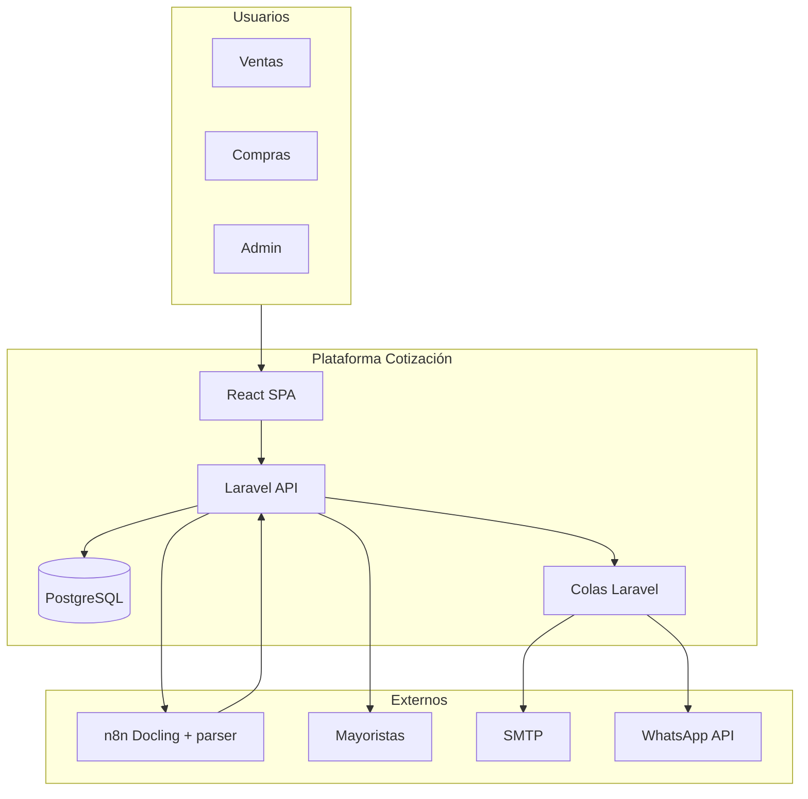

# Diseño del sistema — Cotizaciones B2B

Documentación técnica y funcional del proyecto completo. Sirve como referencia para implementación por fases.

## Índice

| # | Documento | Contenido |
|---|-----------|-----------|
| 01 | [Visión y alcance](./01-vision-y-alcance.md) | Objetivos, usuarios, fuera de alcance |
| 02 | [Arquitectura](./02-arquitectura.md) | Capas, servicios, flujos, despliegue |
| 03 | [Modelo de datos](./03-modelo-datos.md) | Entidades, relaciones, índices |
| 04 | [API REST](./04-api-rest.md) | Endpoints, payloads, códigos de error |
| 05 | [Seguridad y roles](./05-seguridad-roles.md) | RBAC, permisos, autenticación |
| 06 | [Módulos funcionales](./06-modulos-funcionales.md) | Pantallas y comportamiento por módulo |
| 07 | [Integraciones](./07-integraciones.md) | n8n, mayoristas, email, WhatsApp |
| 08 | [Frontend](./08-frontend.md) | Estructura React, rutas, estado |
| 09 | [Reglas de negocio](./09-reglas-negocio.md) | Profit, IVA, estados, folios |
| 10 | [Fases y entregables](./10-fases-entregables.md) | Roadmap Fase 1–3 con checklist |

## Diagrama de contexto

## Convenciones

- **IDs públicos:** UUID en API (`id` en JSON); PK interna `bigint` opcional en BD.
- **Moneda:** MXN por defecto; montos `decimal(15,4)` en BD.
- **Zona horaria:** `America/Mexico_City`.
- **IVA por defecto:** 16% (configurable por empresa).
- **Margen por defecto:** 30% sobre costo (ver [reglas de negocio](./09-reglas-negocio.md)).

## Estado del diseño

| Área | Estado |
|------|--------|
| Arquitectura | Definido |
| Modelo de datos | Definido |
| API Fase 1 | Definido |
| API Fase 2–3 | Borrador (marcado en doc) |
| Frontend | Definido |
| Implementación código | Pendiente (scaffold actual) |

Última actualización del diseño: **2026-06-01**.
